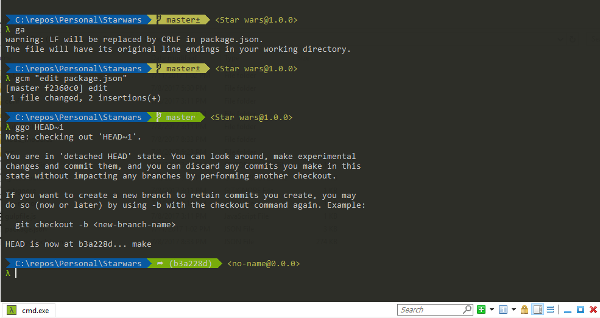

# PowerCmder
Based on the great work by : Amr Eldib
https://github.com/AmrEldib/cmder-powerline-prompt 

# OpenCmderHere.reg
Use this file to add open cmder to your context menu (right click menu)
Please replace Cmder.exe path inside this file before using it

# powerline_prompt.lua
This is where the magic happens. A prompt is created with git status and node package name, version

**Using Monokai theme

# user-aliases.cmd
Some predefined aliases for directories, git and npm

# font
Anonymice Powerline font : https://github.com/powerline/fonts/blob/master/AnonymousPro/Anonymice%20Powerline.ttf

